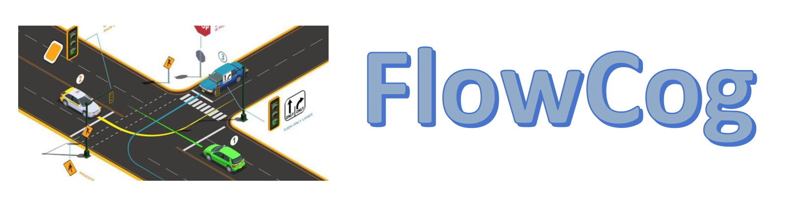
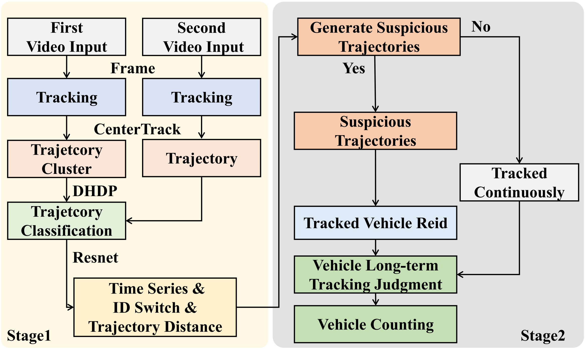
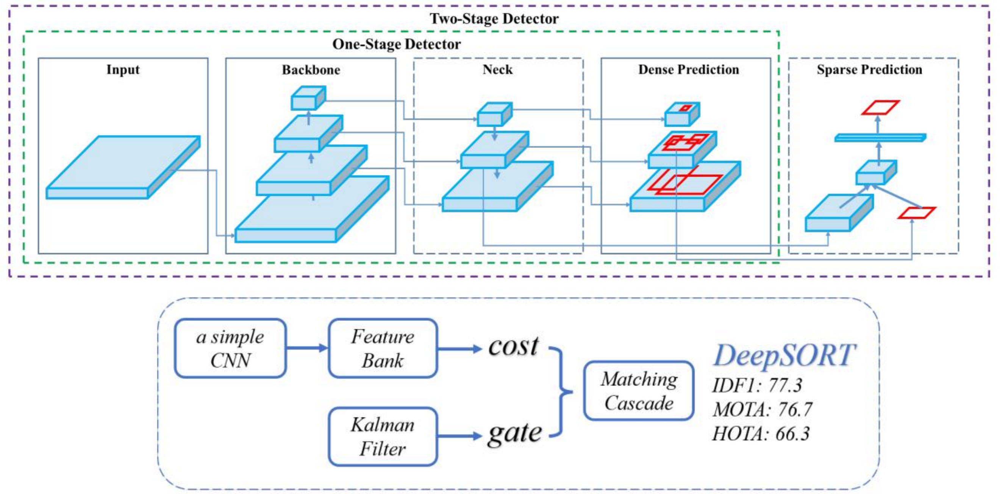
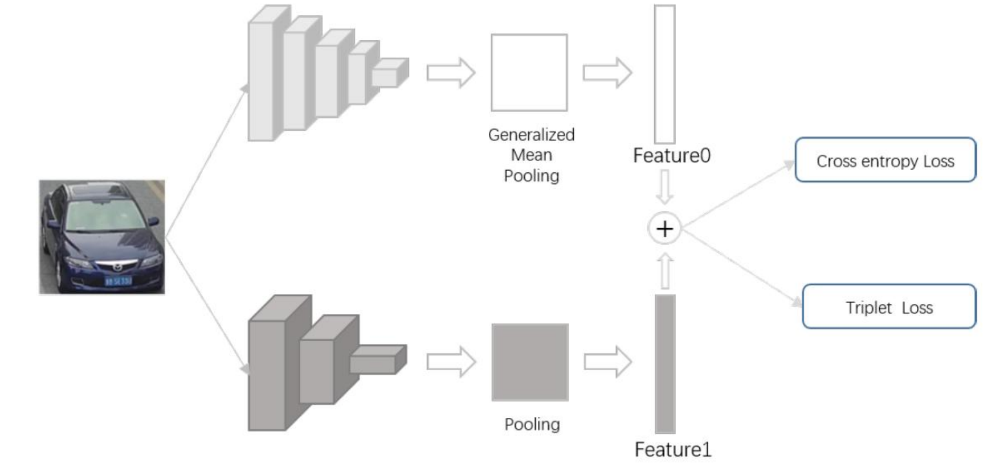
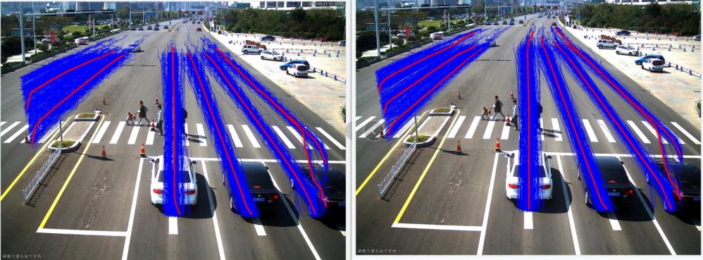
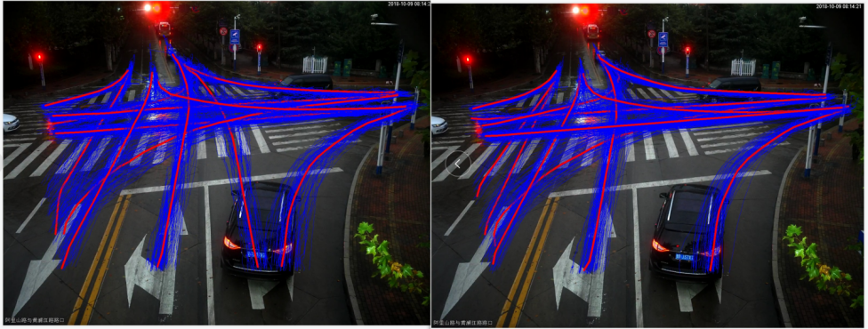
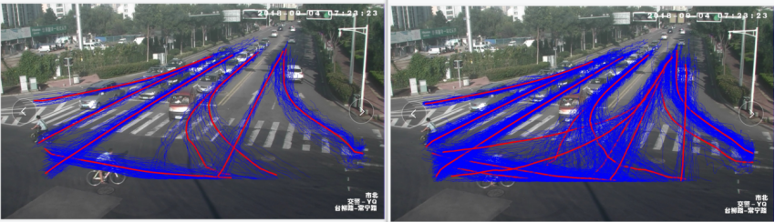
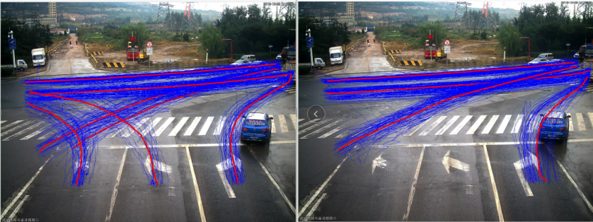
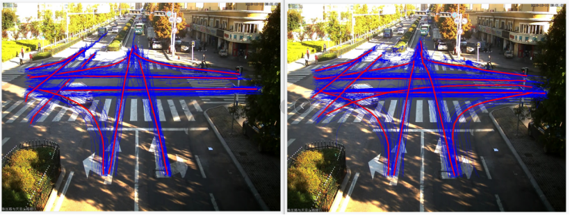
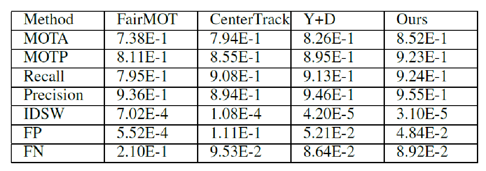

# FlowCog


 


**Data-Driven Scene Perception and Understanding for Dynamic Traffic in Congested Urban Networks **

* **Source code: can be deployed and run locally.** (Source Code)
    Code-FlowCog.zip

* **Demo: Real-time camera-based tracking and counting in complex urban traffic scenes (Shenzhen & Guangzhou)** (Demo Video)
    Demo.flv: Actual deployment
    FlowCog+PPT+Demo-5min.mp4: Video introduction

* **Demo Slides: Test Results in Real Scenarios and Tracking Statistics** (Demo Talk)
    FlowCog-PPT.pdf


<font size=20>**Framework**</font>

To tackle the challenge of vehicle tracking in congested traffic scenarios, we introduce an efficient long-term vehicle tracking strategy called FlowCog. This strategy comprises several key components. First, we achieve short-term vehicle tracking using a detection and tracking approach that primarily leverages the offset between consecutive frames for tracking correlation. Next, we use the short-term tracking results to predict vehicle trajectories, which helps structure road information and determine vehicle paths. Third, we match suspicious trajectories with corresponding detection boxes using a vehicle re-identification model. The model incorporates multi-domain learning and a re-ranking strategy, which employs feature-based trajectory-level reordering to improve matching accuracy. Finally, we apply trajectory matching to address vehicle loss caused by occlusion over extended periods, thereby enhancing tracking accuracy and robustness. Our proposed method demonstrates promising performance in experiments, providing an effective solution for vehicle tracking in congested traffic scenarios.

 


The FlowCog framework is illustrated in the Figure and comprises a two-stage tracking process. The initial stage is dedicated to generating structured road information, while the subsequent stage is concerned with evaluating suspicious trajectories. The process encompasses the following steps:


1. Vehicle Tracking. We use the YOLOv4 plus Deepsort, to track multiple vehicles in surveillance videos from a busy traffic intersection over approximately one hour. The process generates vehicle trajectory (blue line) data from every passed car in the surveillance camera.


2. Trajectory Clustering. We employ a Dual Hierarchical Dirichlet process (DHDP) to cluster trajectories from the first video segment. The method identifies representative trajectories for each lane, capturing lane direction and width. Figure (a) displays these representative trajectories (red line).


3. Trajectory Classification. We utilize the generated representative trajectories and employ ResNet for trajectory classification. The process labels trajectories in the four directions: Up, Down, Left, and Right (UDLR).


4. Vehicle Tracking. The YOLOv4 combined with DeepSort is used to track vehicles in the second video, generating new vehicle trajectories. These new trajectories will be classified using a classification algorithm. The vehicle tracking results from the initial stage are shown in Figure (b).


5. Abnormal Trajectory Generation. Using the classified trajectories from the previous step, we record a list of trajectory identity (car number) in Figure with switches and generate pairs of abnormal trajectories based on the sequence and distance between them on representative trajectories.


6. Vehicle Re-identification. We use the generated abnormal trajectory pairs to extract detection boxes corresponding to the trajectory identity (ID), and then apply a vehicle re-identification algorithm to perform feature extraction and comparison based on appearance features and license plate information.


7. Identity Switch Restoration. Using the abnormal trajectory pairs and re-identification results generated in the previous step, we determine whether they belong to the same vehicle. If they do, the new ID is reverted to the original ID, enabling long-term vehicle tracking and enhancing the accuracy and robustness of the tracking process. The vehicle tracking results from the final stage are shown in Figure (c).


<font size=20>**Vehicle Tracking Strategy**</font>


 


<font size=20>**Vehicle Reidentification**</font>

The model identifies suspicious vehicle images obtained by the ST module and judges whether the current suspicious vehicle exists. The training takes place simultaneously in both branches. The first extracts the global feature from the detected image through Resnet50 and obtains feature0 through the pooling layer. The
branch uses the LPRNet to detect images for local detail feature extraction. u The using of the max-pooling layer to obtain a fine-grained feature feature1. For the features feature0 and feature1, it use the concatenation to perform feature fusion.

 


<font size=20>**Representative  Trajectory**</font>


FlowCog obtain the position information of each ID detection frame between consecutive frames obtained by vehicle tracking. The corresponding vehicle trajectory is generated while the vehicle is tracked. u The vehicle trajectory information is clustered to obtain the structured data. We use the Dual Hierarchical Dirichlet Processes to co-cluster trajectory points and track trajectory lines. u The track trajectory lines with similar distributions over representative trajectory clusters can be grouped into one collection. Two Hierarchical Dirichlet processes model a tracked trajectory line of trajectory points.







<font size=20>**Experiments**</font>


1. The training process utilizes UA-DETRAC for vehicle detection and tracking, and VERI-Wild for vehicle re-identification. The comparison methods include FairMOT, CenterTrack and YOLOv3 plus Deepsort. The evaluation metrics are Multi-Object Tracking Accuracy (MOTA), Multi-Object Tracking Precision (MOTP), Recall, and Identity Switches (IDS).
2. Our tests encompass a wide range of scenarios on urban roads across numerous cities, such as shenzhen, guangzhou, and dongguan. 


 

FairMOT is a multi-target tracking with better performance. Y+D is a method that fuses Deepsort with the YOLOv4 for object detection and vehicle RE-ID tasks, with fast processing speed and high accuracy. u We mainly employ MOTA, MOTP and IDSW for measurement in terms of tracking performance. u Compared with Y+D, our method improves by 2.5% and 2.8% in MOTA and MOTP, respectively and reduces by 26.2% in IDSW compared withY+D. Recall shows our method achieves 92.4%, which is the best and is 1.1% higher than the benchmark Y+D in detection performance. u In addition, the average FPS under FairMOT, Y+D, CenterTrack, ours models are: 10, 13, 20, 12. indicating that our method takes less time than bothCenterTrack and Y+D. Table. I indicates the tracking performance of FairMOT is poor, so our method can achieve good results on the premise of ensuring performance


<font size=25>**Visualization**</font>

Left: The begining of tracking; Left: The long-term vehicle tracking

  


Real-time tracking in various traffic scenarios

  


# Scene Understanding and Counting

This project enables automatic extraction of the traffic road network and real-time, lane-level vehicle counting in previously unseen surveillance scenes. It comprises three sub-modules:

(1) Edge module: Performs multi-object tracking (MOT) to generate vehicle trajectories; computes lane-level traffic counts by combining trajectories with the road network; uploads trajectory data to the cloud module.

(2) Cloud module: When sufficient trajectory data has been uploaded, conducts trajectory clustering, road modeling, and road classification, then updates the traffic road network and pushes it back to the edge.

(3) Communication module: Handles message exchange between the edge and the cloud.


## Getting Started

### Prerequisites

#### Clone this repository
```bash
git clone --recurse-submodules https://git.pcl.ac.cn/digital-retina-alg/traffic-UAC.git && cd traffic-UAC
``` 

#### Setup runtime environment
This project runs inside a Docker container; the docker/ directory contains the [Dockerfile] used to build the image.(https://git.pcl.ac.cn/digital-retina-alg/traffic-UAC/src/branch/master/docker/Dockerfile)
```bash
# compile trajectory related modules
mkdir build
cd build
cmake -DCMAKE_BUILD_TYPE=Release ..
# compile c modules and python extensions
make all
# test
make runtest
# install python dependencies
make init

# setup CenterTrack runtime
# if DCNv2 directory already exists, skip this git clone step
cd ../CenterTrack/src/lib/model/networks
git clone https://github.com/CharlesShang/DCNv2
# compile DCNv2 module
cd DCNv2
python setup.py build
python setup.py develop
```

## Usage

### Head module
```bash
cd $root
python head_app.py --data_path $video_path --tracker CenterTrack --track_thresh 0.4 \
    --load_model CenterTrack/exp/tracking/detrac_train/model_epoch_15.pth \
    --gpus 0
```
### Cloud module
#### Train

```bash
python train.py /data_dir --traj_sample_num 21
```

- `/data_dir` directory that holds the training files (the training files must be .txt).
- `--traj_sample_num` number of samples taken from each trajectory during feature extraction (default: 21).
- After training, the model is saved in the current working directory as classification.pkl.


#### Validate

```
python validate.py /val_dir /model_path --sample_num 21
```

- `/val_dir` Specify the directory containing the validation set, where the trajectory files are in .txt format.

#### Service

```bash
python server_app.py --log_dir /tmp/trafficUAC
```

- `--log_dir` Specify the path where the trajectory clustering model is stored.

#### Predict

```
python predict.py /test_dir /model_path --save out.bin --sample_num 21
```

- `/test_dir` Directory containing the trajectories to be inferred; each trajectory file must be in .bin format.
- `/model_path` Path to the model file.
- `--save ` Name of the output binary file that stores predictions and trajectory information; defaults to out.bin.
- `--traj_sample_num` Number of samples per trajectory used for feature extraction; default is 21.


